<!-- README.md is generated from README.Rmd. Please edit that file -->

[](https://creativecommons.org/licenses/by/4.0/)
[](https://github.com/sebastianvanbaalen/causalplot)

# causalplot <a href="#">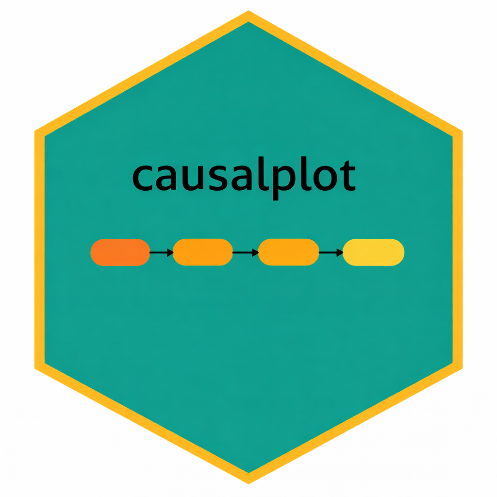</a>

<!-- badges: start -->

<!-- badges: end -->

Tired of spending endless time customizing a causal process graph in
Word or trying to decipher the inner workings of the TikZ package in
LaTeX? The goal of `causalplot` is to create publication-ready causal
process plots using a simple convenience function that demands almost
nothing of the user and lets you focus your attention on what actually
matters—the theorizing. Users chose between templates and add their own
variable and mechanism labels, and the package produces a causal plot.
The package also allows for additional customization in terms of text
color, box color, fonts, and captions.

## Installation

You can install the development version of `causalplot` from Github
with:

``` r
# install.packages("devtools")
# devtools::install_github("sebastianvanbaalen/causalplot")
```

## What’s new?

The latest version of `causalplot` includes several new features and
fixes:

- Reduction of white space around the plots.

- Support for causal plots with two independent variables (templates
  `211`, `221`, and `2221`).

- Support for the standard 2x2 descriptive or explanatory typology.

## Bug-reports and suggestions?

Are you missing a template or is something not running as it should?
Make a new issue in the Github repository or email Sebastian at
sebastian.van-baalen@pcr.uu.se.

## Example

Making a causal diagram using `causalplot` is easy. All you need is an
idea, your variable names, and labels for your causal mechanisms or
causal process steps. Use the `type` argument to chose between different
templates in the plot gallery. Below is the code for making the simplest
plot consisting only of three boxes: one for the independent variable,
one for the dependent variable, and one for the causal mechanism.

``` r
causal_plot(
  type = "111",
  labels = c(
    "Lack of natural resources",
    "Increased dependence on civilians",
    "More responsive rebel governance"
  ),
  wrap_width = 16
)
```

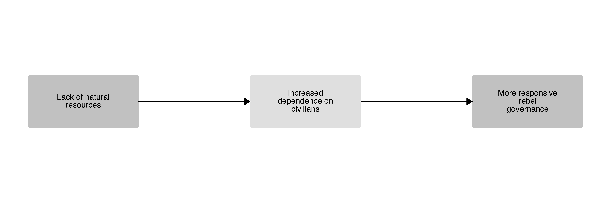

## Gallery

`causalplot` includes several different templates and requires no manual
definition of nodes and arrows, simplifying the plotting experience.
Below is an overview of all available templates, as well as examples of
how to customize the plots. Feel free to reach out if you are missing a
particular set-up.

### One-step causal mechanism

A simple one-step causal mechanism plot with an independent variable,
dependent variable, and one causal mechanism box.

``` r
causal_plot(
  type = "111", # Chose the plot template
  text_size = 5, # Set the text size
  box_ratio = 1 # Increase the box height
)
```

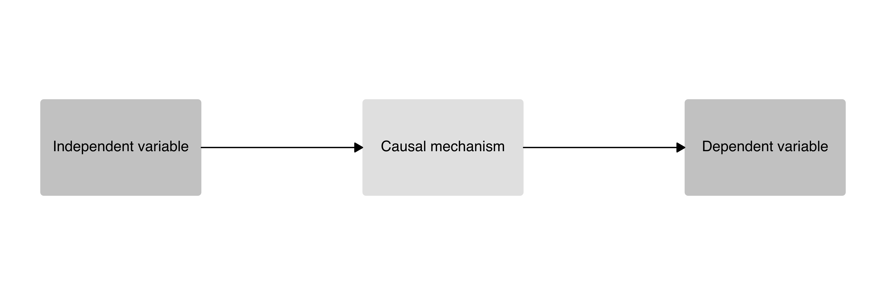

### Two-step causal mechanism

A two-step causal mechanism plot with an independent variable, dependent
variable, and two causal process boxes.

``` r
causal_plot(
  type = "1111", 
  text_size = 4,
  wrap_width = 17, # Set the number of characters before line skip
  fill_mechanisms = "white" # Set the color of the process boxes
)
```

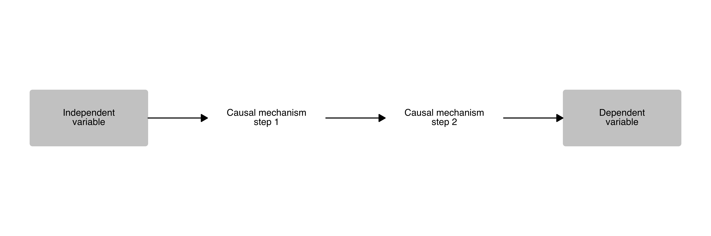

### Three-step causal mechanism

A three-step causal mechanism plot with an independent variable,
dependent variable, and three causal process boxes.

``` r
causal_plot(
  type = "11111",
  text_size = 4
)
```


### Dual-pathway causal mechanism

A two-step causal mechanism plot with an independent variable, dependent
variable, and two separate causal pathways.

``` r
causal_plot(
  type = "1221", 
  labels = c(
    "Independent variable",
    "Path 1: mechanism step 1",
    "Path 2: mechanism step 1",
    "Path 1: mechanism step 2",
    "Path 2: mechanism step 2",
    "Dependent variable"
  ),
  wrap_width = 17,
  text_size = 4,
  fill_mechanisms = "black",
  fill_variables = "black",
  text_color = "white",
  font = "Times" # Set the font
)
```

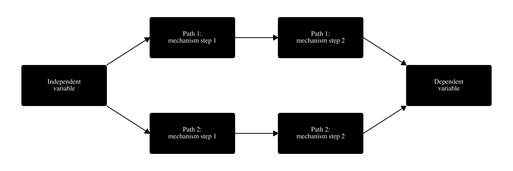

### Dual-pathway causal mechanism with joint first step

``` r
causal_plot(
  type = "1121", 
  labels = c(
    "Independent variable",
    "Shared mechanism step 1",
    "Path 1: mechanism step 2",
    "Path 2: mechanism step 2",
    "Dependent variable"
  ),
  wrap_width = 17,
  text_size = 4,
  fill_variables = "grey50", # Set the color for the variable boxes
  fill_mechanisms = "grey80" # Set the color for the process boxes
)
```

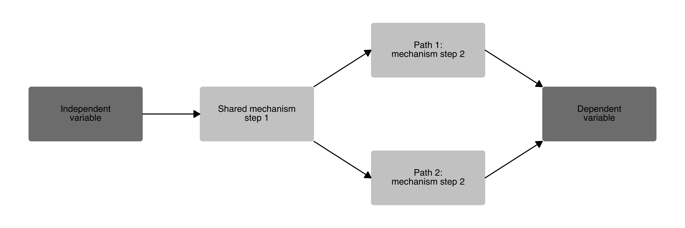

### Dual-pathway causal mechanism with joint second step

``` r
causal_plot(
  type = "1211", 
  labels = c(
    "Independent variable",
    "Path 1: mechanism step 1",
    "Path 2: mechanism step 1",
    "Shared mechanism step 2",
    "Dependent variable"
  ),
  wrap_width = 17,
  text_size = 4,
  fill_variables = "#59C7EB",
  fill_mechanisms = "#CCEEF9"
)
```

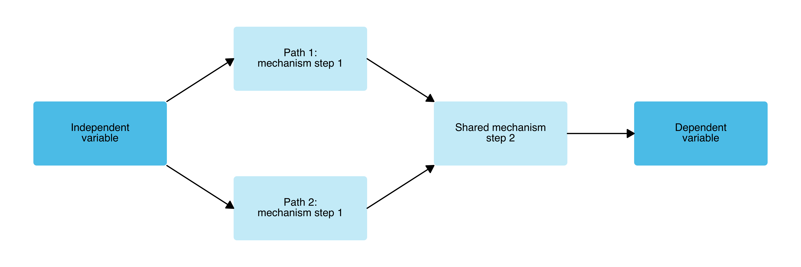

### The classic “bathtub” causal mechanism

The classic “bathtub” visualization of a causal relationship as
discussed in Hedström and Ylikoski (2010), with a direct macro-level
arrow and a two-step causal mechanism.

``` r
causal_plot(
  type = "bathtub",
  text_size = 4,
  fill_variables = "#31A354",
  fill_mechanisms = "#BAE4B3"
)
```

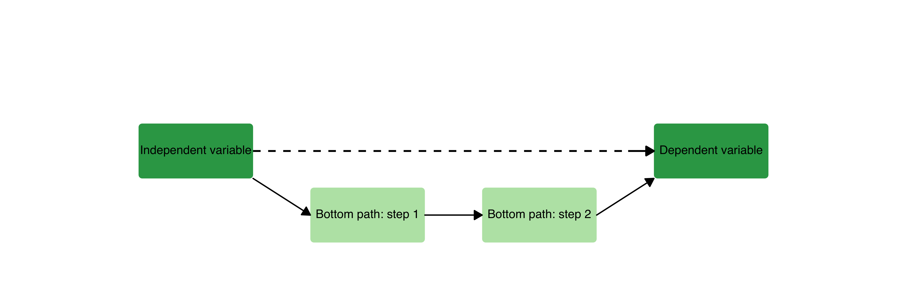

### One-step causal mechanism with moderator

A one-step causal mechanism plot with an independent variable, dependent
variable, one causal mechanism box, and a moderator variable.

``` r
causal_plot(
  type = "111_moderator",
  labels = c(
    "Independent variable",
    "Causal mechanism",
    "Dependent variable",
    "Moderator variable"
  ),
  text_size = 4
)
```

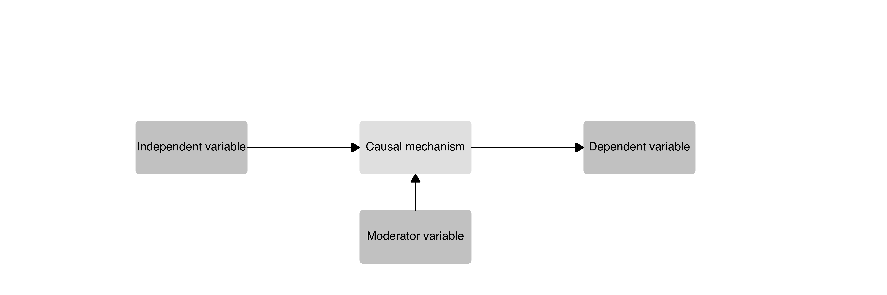

### One-step causal mechanism with confounder

A one-step causal mechanism plot with an independent variable, dependent
variable, one causal mechanism box, and a confounding variable.

``` r
causal_plot(
  type = "111_confounder",
  labels = c(
    "Independent variable",
    "Causal mechanism",
    "Dependent variable",
    "Confounding variable"
  ),
  text_size = 4
)
```

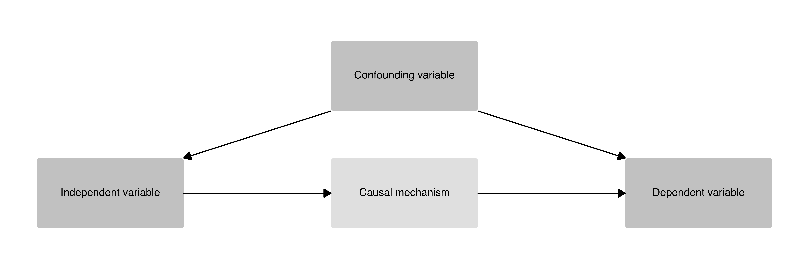

### Two independent variables with shared mechanism

A causal diagram with two independent variables that converge on a
shared causal mechanism before producing a single outcome. A “+” sign
indicates that both IVs are necessary.

``` r
causal_plot(
  type = "211",
  labels = c(
    "Resource scarcity",
    "Civilian dependence",
    "Institutional adaptation",
    "Responsive governance"
  ),
  text_size = 4,
  wrap_width = 17
)
```

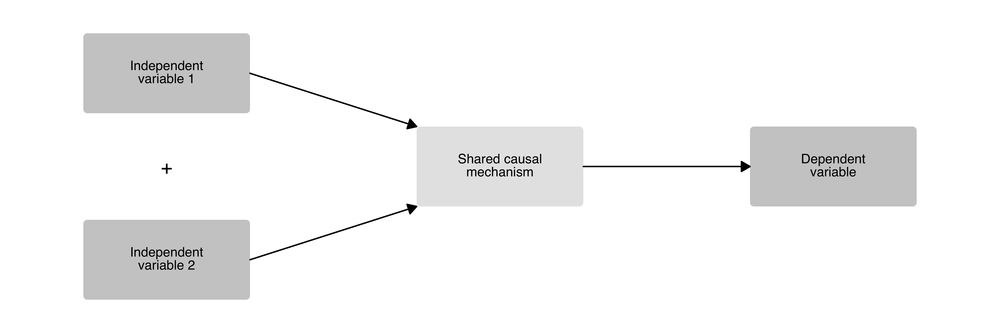

### Two independent variables with separate mechanisms

A causal diagram with two independent variables, each operating through
its own mechanism, converging on a single outcome. A “+” sign indicates
that both mechanisms are necessary.

``` r
causal_plot(
  type = "221",
  labels = c(
    "Economic shocks",
    "Political grievances",
    "Resource competition",
    "Identity mobilization",
    "Civil conflict onset"
  ),
  text_size = 4,
  wrap_width = 17
)
```

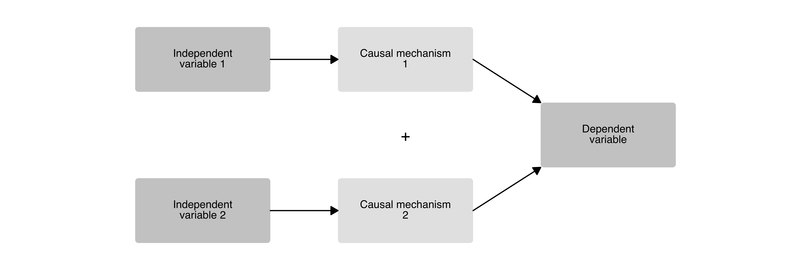

### Two independent variables with two-step separate mechanisms

A causal diagram with two independent variables, each going through two
sequential mechanism steps, before converging on a single outcome.

``` r
causal_plot(
  type = "2221",
  labels = c(
    "Economic shocks",
    "Political grievances",
    "Market disruption",
    "Elite fragmentation",
    "Resource competition",
    "Identity mobilization",
    "Civil conflict onset"
  ),
  text_size = 4,
  wrap_width = 17
)
```

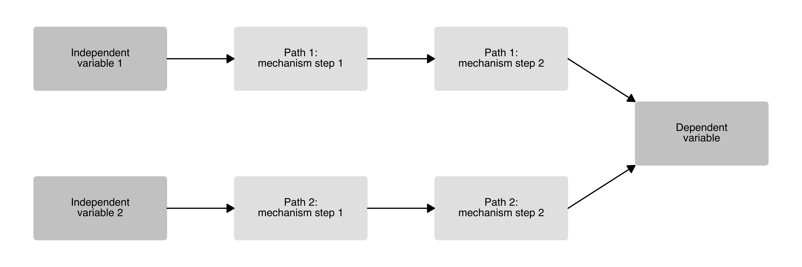

## Typology

In addition to causal diagrams, `causalplot` also includes a
`typology()` function for creating 2x2 descriptive or explanatory
typologies. The function produces a single box divided into four
quadrants by dashed lines, with double-headed axis arrows, axis labels,
endpoint values, and type labels. The example below replicates the
typology in Martin, Piccolino, and Speight (2021).

``` r
typology(
  type_labels = c(
    "Predation",
    "Benevolent warlordism",
    "State capture",
    "Rebels-into-statesmen"
  ),
  x_axis_label = "Strength of local-level ties",
  y_axis_label = "Strength of national-level ties",
  x_axis_values = c("Weak", "Strong"),
  y_axis_values = c("Weak", "Strong"),
  text_size = 4,
  axis_text_size = 4
)
```

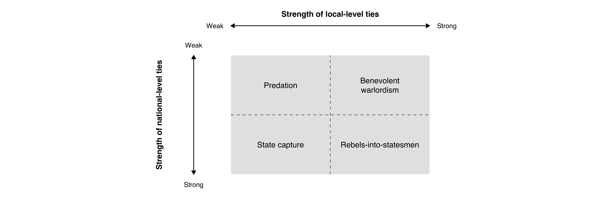

## Save your plot

`causalplot` uses `ggplot2` to generate the plots, so they can be saved
using the `ggsave` command.

``` r
ggplot2::ggsave("man/figures/causal_plot.png", height = 5, width = 12)
```

## Citation

Did you like the package? No need to cite it, but please add a footnote
somewhere with the following text:

> “Generated using the causalplot R package created by Sebastian van
> Baalen.”

## References

<div id="refs" class="references csl-bib-body hanging-indent"
entry-spacing="0">

<div id="ref-hedstrom2010" class="csl-entry">

Hedström, Peter, and Petri Ylikoski. 2010. “Causal Mechanisms in the
Social Sciences.” *Annual Review of Sociology* 36: 49–67.
<https://doi.org/10.1146/annurev.soc.012809.102632>.

</div>

<div id="ref-martinetal2021" class="csl-entry">

Martin, Philip A., Giulia Piccolino, and Jeremy S. Speight. 2021.
“Ex-Rebel Authority After Civil War: Theory and Evidence from Côte
d’ivoire.” *Comparative Politics* 53 (2): 209–32.
<https://www.jstor.org/stable/26976051>.

</div>

</div>
