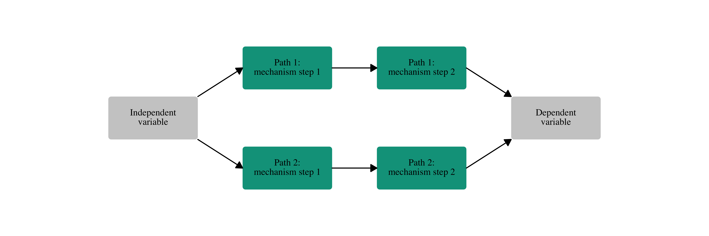
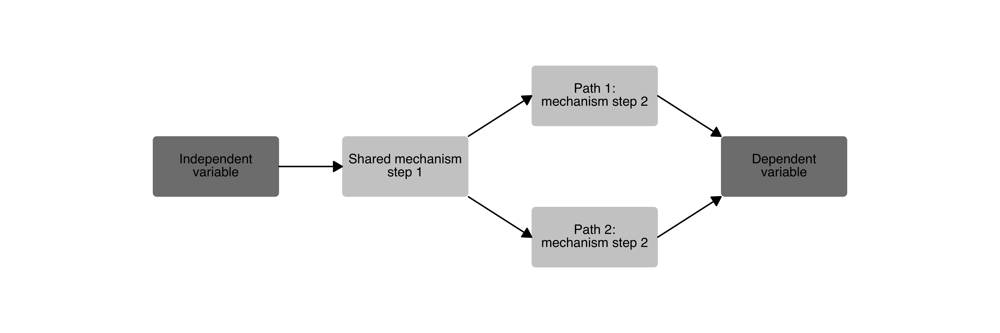

<!-- README.md is generated from README.Rmd. Please edit that file -->

[](https://creativecommons.org/licenses/by/4.0/)

# causalplot <a href="#"></a>

<!-- badges: start -->

<!-- badges: end -->

Tired of spending endless time customizing a causal process graph in
Word or trying to decipher the inner workings of the TikZ package in
LaTeX? The goal of `causalplot` is to create publication-ready causal
process plots using a simple convenience function that demands almost
nothing of the user and lets you focus your attention on what actually
matters—the theorizing. Users chose between templates and add their own
variable and mechanism labels, and the package produces a causal plot.
The package also allows for additional customization in terms of text
color, box color, fonts, and captions.

## Installation

You can install the development version of `causalplot` from Github
with:

``` r
# install.packages("devtools")
# devtools::install_github("sebastianvanbaalen/causalplot")
```

## Bug-reports and suggestions?

Are you missing a template or is something not running as it should?
Submit a report through Github or email Sebastian at
sebastian.van-baalen@pcr.uu.se.

## Example

Making a causal diagram using `causalplot` is easy. All you need is an
idea, your variable names, and labels for your causal mechanisms or
causal process steps. Use the `type` argument to chose between different
templates in the plot gallery. Below is the code for making the simplest
plot consisting only of three boxes: one for the independent variable,
one for the dependent variable, and one for the causal mechanism.

``` r
causal_plot(
  type = "111",
  labels = c(
    "Lack of natural resources",
    "Increased dependence on civilians",
    "More responsive rebel governance"
  ),
  wrap_width = 16
)
```


## Gallery

`causalplot` includes several different templates and requires no manual
definition of nodes and arrows, simplifying the plotting experience.
Below is an overview of all available templates, as well as examples of
how to customize the plots. Feel free to reach out if you are missing a
particular set-up.

### One-step causal mechanism

A simple one-step causal mechanism plot with an independent variable,
dependent variable, and one causal mechanism box.

``` r
causal_plot(
  type = "111", # Chose the plot template
  text_size = 3, # Set the text size
  box_ratio = 1 # Increase the box height
)
```


### Two-step causal mechanism

A two-step causal mechanism plot with an independent variable, dependent
variable, and two causal process boxes.

``` r
causal_plot(
  type = "1111", 
  text_size = 4,
  wrap_width = 17, # Set the number of characters before line skip
  fill_mechanisms = "white" # Set the color of the process boxes
)
```


### Dual-pathway causal mechanism

A two-step causal mechanism plot with an independent variable, dependent
variable, and two separate causal pathways.

``` r
causal_plot(
  type = "1221", 
  wrap_width = 17,
  text_size = 4,
  fill_mechanisms = "#00A08A",
  font = "Times" # Set the font
)
```



### Dual-pathway causal mechanism with joint first step

``` r
causal_plot(
  type = "1121", 
  wrap_width = 17,
  text_size = 4,
  fill_variables = "grey50", # Set the color for the variable boxes
  fill_mechanisms = "grey80" # Set the color for the process boxes
)
```



### Dual-pathway causal mechanism with joint second step

``` r
causal_plot(
  type = "1211", 
  wrap_width = 17,
  text_size = 4,
  fill_variables = "#59C7EB",
  fill_mechanisms = "#CCEEF9"
)
```


### The classic “bathtub” causal mechanism

The classic “bathtub” visualization of a causal relationship (for
instance, discussed
[here](https://doi.org/10.1146/annurev.soc.012809.102632)) with a direct
macro-level arrow and a two-step causal mechanism.

``` r
causal_plot(
  type = "bathtub",
  text_size = 4,
  fill_variables = "#31A354",
  fill_mechanisms = "#BAE4B3"
)
```


## Save your plot

`causalplot` uses `ggplot2` to generate the plots, so they can be saved
using the `ggsave` command.

``` r
ggplot2::ggsave("man/figures/causal_plot.png", height = 5, width = 12)
```

## Citation

Did you like the package? No need to cite it, but please add a note to
your figure with the following text:

> “Generated using the causalplot R package created by Sebastian van
> Baalen.”
